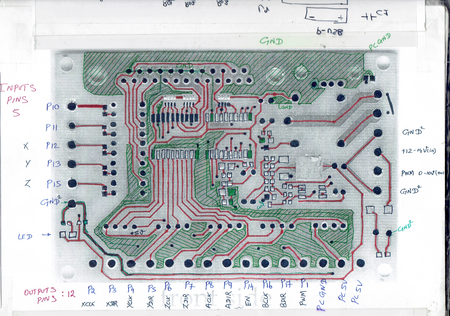
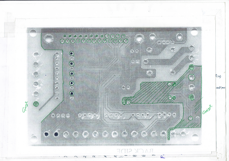
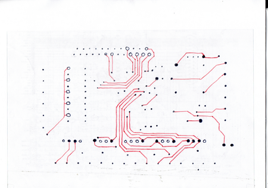
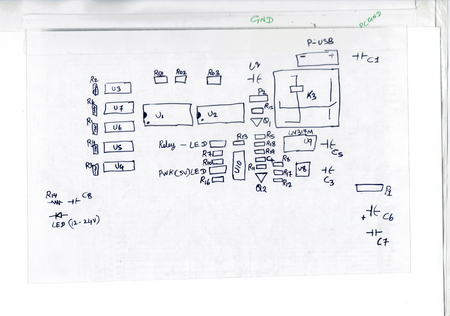
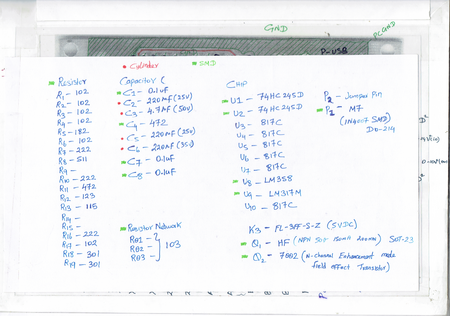

_Clone
Cloning a PCB involves creating an exact copy by reverse-engineering its layout, components, and connections. This process includes capturing the schematic, tracing all circuit pathways, and recreating the PCB design in E-CAD software for reproduction.

**PCB Cloning procedure**

  
  
  
  
  

</iframe>

**Step:1**

First, remove all the components.

**Step:2**

Next, capture the PCB board.

**Step:3**

Then, dip the PCB into heated hydrogen peroxide.

**Step:4**

This will remove all the PCB mask, allowing you to view the copper traces of the PCB.

**Step:5**

This makes it easier to create the schematic.

**Ki-Cad_Tips**

Study:

https://www.nextpcb.com/blog/pcb-clone
https://www.proto-electronics.com/blog/the-top-5-rules-for-digital-pcb-design

Tips:For PCB MAKE

https://github.com/festlv/rioctrl-hw/

RP2040

https://hackaday.com/2023/08/11/grblhal-cnc-controller-based-on-rp2040-pico/
https://github.com/phil-barrett/PicoCNC
https://adiy.in/shop/pico-rp2040-board-adiy-fly-with-sd-card/?srsltid=AfmBOop2cv2Rthae3tRddB-vea9H9Uiu8QY2nclY48Ca5xgUpeF41pRp

https://github.com/grblHAL/RP2040

ESP32
https://hackaday.com/2018/07/26/grbl-ported-to-the-esp32/

https://github.com/bdring/6-Pack_CNC_Controller

https://www.buildlog.net/blog/2018/07/grbl-cnc-firmware-on-esp32/
https://github.com/bdring/Grbl_Esp32
https://hackaday.com/2017/12/28/coasty-the-coaster-toaster/

https://github.com/phil-barrett/ADCI_1

https://github.com/phil-barrett/GRBL_MPG_DRO_BoosterPack

https://github.com/phil-barrett/simple_stepper_motor_analyzer/tree/master

https://hackaday.com/2018/07/26/grbl-ported-to-the-esp32/

https://github.com/adafruit/circuitpython

https://adafruit-circuit-python.s3.amazonaws.com/index.html?prefix=bin/raspberry_pi_pico/

https://github.com/bobricius/PyPrCa

https://github.com/Jean-MarcHarvengt/MCUME/tree/master

https://github.com/Jean-MarcHarvengt/MCUME/blob/master/MCUME_pico/schematic/MCUME_REV1/Schematic_MCUMEpico_2021-04-10_thumbnail.png

try_TOMORROW

https://hackaday.io/contest/190152-supplyframe-designlab-2023-hackaday-prize/log/216919-challenge-1-re-engineering-education

https://prize.supplyframe.com/

https://www.pcbway.com/project/shareproject/The_10Robot_Robot_Control_Pad_cdd54d30.html

https://github.com/Jean-MarcHarvengt/MCUME/tree/master

